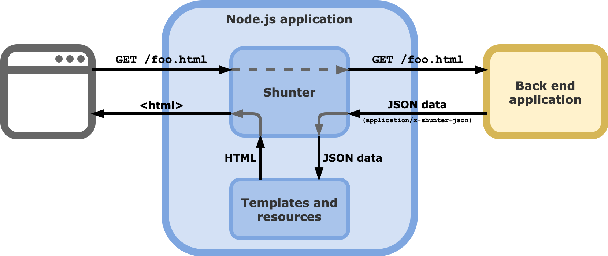
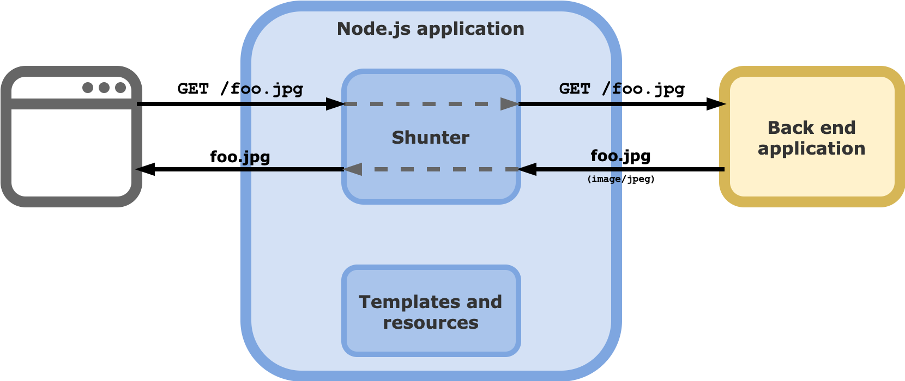

# 

Shunter is a [Node.js][node] module built to read JSON and translate it into HTML.

It helps you create a loosely-coupled front end application which can serve traffic from one or more back end applications — great for use in multi-language, multi-disciplinary teams, or just to make your project more flexible and future-proofed.

Shunter does not contain an API client, or any Controller logic (in the [MVC](https://en.wikipedia.org/wiki/Model%E2%80%93view%E2%80%93controller) sense). Instead, Shunter simply proxies requests to a back end server, then:

1. If the back end wants Shunter to render the response, it returns the application state as JSON, served with a certain HTTP header. This initiates the templating process in Shunter.


2. If the back end wishes to serve the response, it omits the header and Shunter proxies the request back to the client.


3. Shunter is also able to serve resources like CSS, JS, or images bundled with the templates as part of your application.


[![NPM version][shield-npm]][info-npm]
[![Node.js version support][shield-node]][info-node]
[![Build status][shield-build]][info-build]
[![LGPL-3.0 licensed][shield-license]][info-license]

## Key features

* Allows the creation of templates loosely coupled to the underlying back end applications.
* Enables multiple back end applications to use the same unified front end.
* Makes full site redesigns or swapping out back end applications very easy.
* Completely technology-agnostic; if your application outputs JSON, it can work with Shunter.
* Asset concatenation, minification, cache-busting, and other performance optimisations built-in.
* Can output any type of content you like, e.g. HTML, RSS, RDF, etc.
* Well-tested and supported, serving [Scientific American](https://www.scientificamerican.com) as well as many high-traffic sites across the Springer Nature portfolio.

## Getting started

You can find all the details about how to use Shunter in our [documentation](docs/index.md). If you're new to Shunter, we recommend reading the [Getting Started Guide](docs/getting-started.md). This will teach you the basics, and how to create your first Shunter-based application.

## Requirements

Shunter requires [Node.js][node] 10+ to run. You can find instructions for Windows, macOS and Linux below.

See the [Getting started documentation](docs/getting-started.md#prerequisites) for more information on Shunter's requirements.

### Windows

On Windows 10, download a pre-built package from the [Node.js][node] website.

### macOS

To install [Node.js][node] you can use the [Node Version Manager (nvm) tool][nvm]:

```sh
nvm install node
```

Alternatively, you can install the required dependency using [Homebrew][brew]:

```sh
brew install node
```

You can also download pre-built packages from the [Node.js][node] website.

### Linux

To install [Node.js][node] you can use the [Node Version Manager (nvm) tool][nvm]:

```sh
nvm install node
```

Depending on your flavour of Linux, you may also be able to use a package manager to install the required dependency.

Alternatively, download pre-built packages from the [Node.js][node] website.

## Support and migration

We maintain a [support guide](docs/support.md) which documents the major versions and their support levels.

We aim to support old major versions of Shunter for 6 months after a new major version is released. This means that security issues and bugs will be fixed whenever feasible.

If you'd like to know more about how we support our open source projects, including the full release process, check out our [support practices document][support].

If you're migrating between major versions of Shunter, we maintain a [migration guide](docs/migration/index.md) to help you.

## Contributing

We'd love for you to contribute to Shunter. We maintain a [guide to help developers](docs/developer-guide.md) get started with working on Shunter itself. It outlines the structure of the library and some of the development practices we uphold.

We also label [issues that might be a good starting-point][starter-issues] for new developers to the project.

## License

Shunter is licensed under the [Lesser General Public License (LGPL-3.0)][info-license].
Copyright &copy; 2015, Springer Nature

[brew]: http://mxcl.github.com/homebrew/
[node]: https://nodejs.org/
[npm]: https://www.npmjs.com/
[nvm]: https://github.com/nvm-sh/nvm
[starter-issues]: https://github.com/springernature/shunter/labels/good-starter-issue
[support]: https://github.com/springernature/frontend-playbook/blob/main/practices/open-source-support.md

[info-coverage]: https://coveralls.io/github/springernature/shunter
[info-dependencies]: https://gemnasium.com/springernature/shunter
[info-license]: LICENSE
[info-node]: package.json
[info-npm]: https://www.npmjs.com/package/shunter
[info-build]: https://travis-ci.org/springernature/shunter
[shield-coverage]: https://img.shields.io/coveralls/springernature/shunter.svg
[shield-dependencies]: https://img.shields.io/gemnasium/springernature/shunter.svg
[shield-license]: https://img.shields.io/badge/license-LGPL%203.0-blue.svg
[shield-node]: https://img.shields.io/badge/node.js%20support-10–14-brightgreen.svg
[shield-npm]: https://img.shields.io/npm/v/shunter.svg
[shield-build]: https://img.shields.io/travis/springernature/shunter/master.svg
